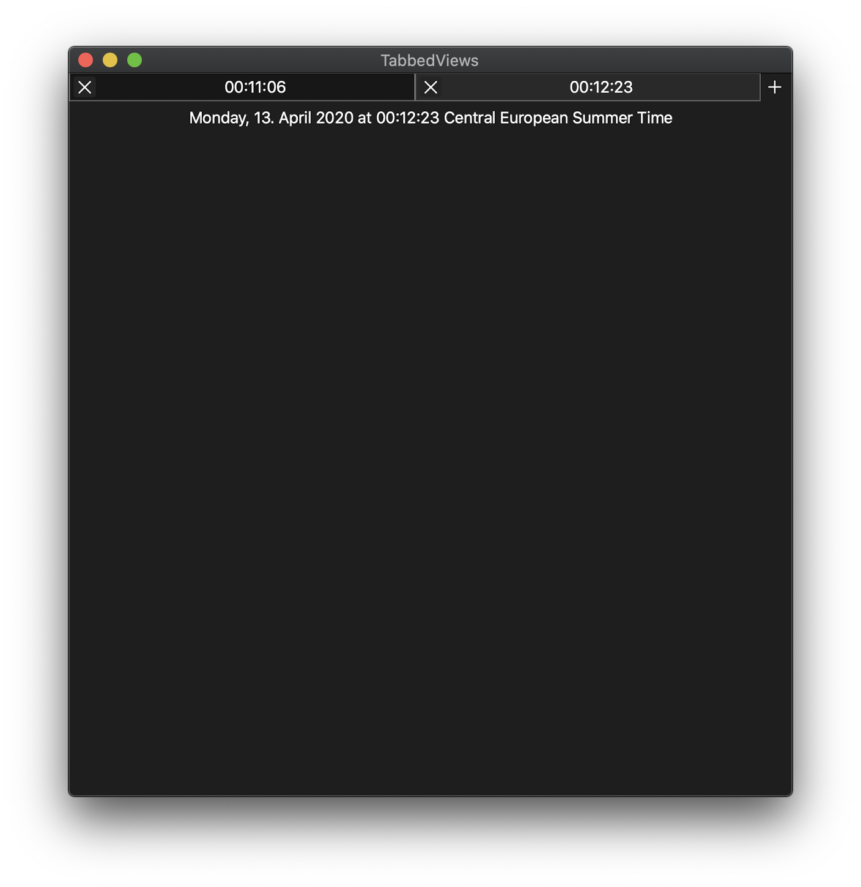
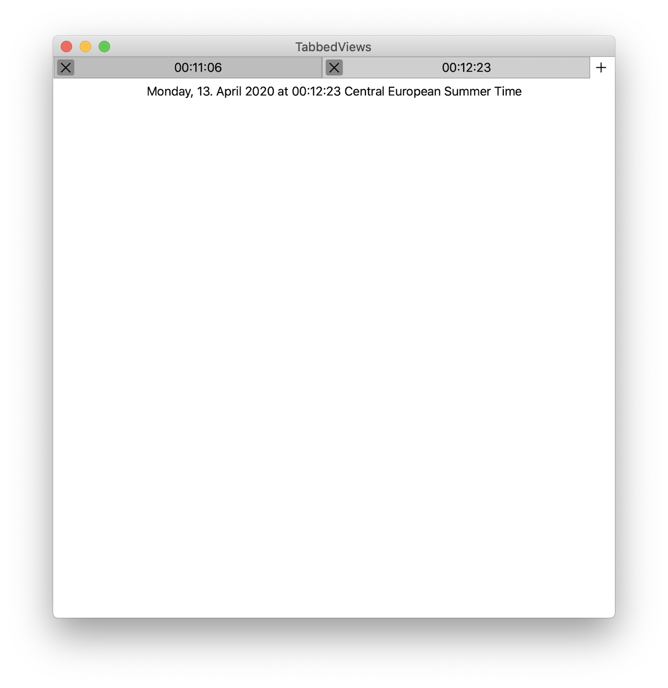

# Tab Bar in SwiftUI on iOS?

If you need to have a Tab Bar similar (Work in Progress) to Safari here is the beginning of it.

Pull Requests are welcome — this is very much a work in Progress.

Replace the `DateView` obviously with your content, and use a bit more than just a `Date` in your Model. 😂

Because `onHover` is broken in Catalina, for the moment, I'm using `onHover2` — Thanks [@paulcolton](https://twitter.com/paulcolton/status/1248791065651326978)!

